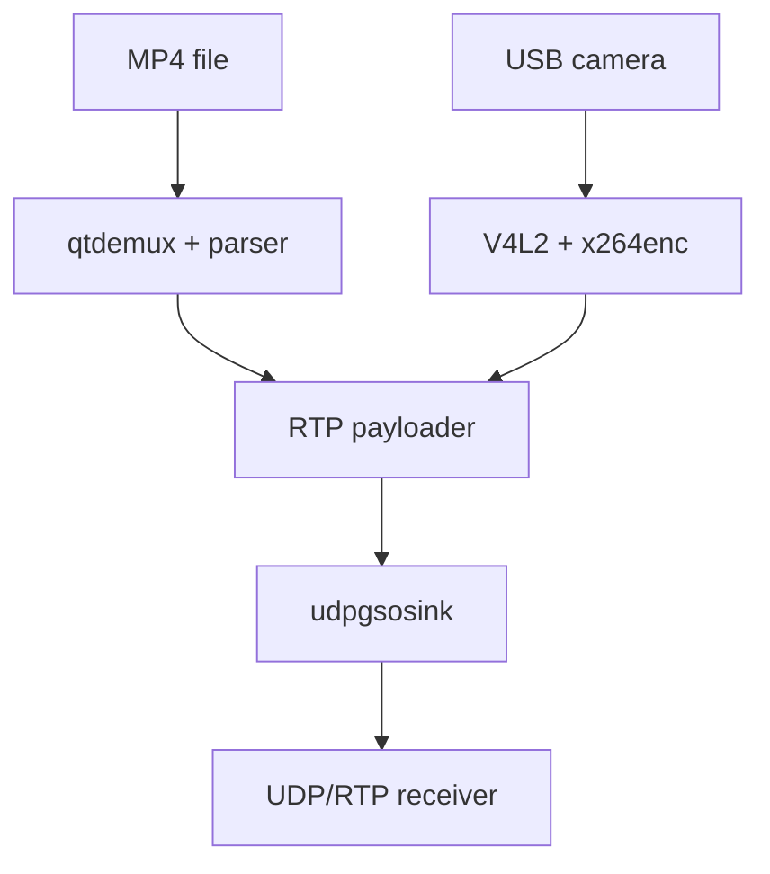

# gst-plugin-udp-gso

`gst-plugin-udp-gso` is an experimental Linux-only GStreamer project for
evaluating high-performance UDP transmission. It provides the custom
`udpgsosink` element and a GTK 3 video-transmitter demonstration application.

The project is currently at version **0.1.0**. It is a working, benchmarkable
foundation for the thesis topic *Development of a high-performance UDP
multimedia plugin for GStreamer*. Kernel packet pacing is part of the planned
next milestone; it is not implemented in this version.

## Current status

| Item | Current implementation |
|---|---|
| GStreamer element | `udpgsosink`, derived from `GstBaseSink` |
| Platform | Linux; x86-64 is the primary test target |
| Destination | One connected IPv4 or IPv6 UDP destination per element |
| I/O backends | `sendmsg`, `sendmmsg`, Linux `UDP_SEGMENT`, and `auto` |
| Input contract | One `GstBuffer` is one UDP datagram; one `GstBufferList` contains multiple datagrams |
| Demo inputs | H.264/H.265 video in an MP4 file; raw or MJPEG USB camera video |
| Demo output | RTP/H.264 or RTP/H.265 over UDP, payload type 96, MTU 1200 |
| Test coverage | Pure-C batch-layout tests and a Linux kernel UDP GSO loopback test |
| License | BSD-3-Clause |

The sink preserves datagram boundaries. It never splits a single
`GstBuffer`, because an arbitrary encoded buffer is not necessarily a set of
independent UDP packets. UDP GSO is used only for a consecutive equal-size run
inside a `GstBufferList`, where every list member already represents one
datagram.

## Implemented features

- scatter/gather transmission of separate `GstMemory` blocks without first
  concatenating them;
- one-datagram `sendmsg()` baseline;
- bounded `sendmmsg()` submission for `GstBufferList` input;
- Linux UDP GSO with `UDP_SEGMENT` for compatible equal-size datagrams;
- automatic fallback from feature-related GSO failures to `sendmmsg()`;
- automatic GSO capability probing when the socket starts;
- configurable batching, GSO run sizes, fallback, and socket send-buffer size;
- thread-safe read-only counters for packets, bytes, system calls, batches,
  segments, and fallbacks;
- a GTK 3 sender supporting MP4 files and USB cameras;
- H.264/H.265 RTP payloading for MP4 input and low-latency H.264 encoding for
  camera input.

## Architecture



MP4 input is demultiplexed and payloaded without decoding or re-encoding. The
camera path converts and encodes captured video before payloading it. The
current application is video-only; MP4 audio tracks are ignored.

## Requirements

- Linux with `sendmmsg()` support;
- Linux 4.18 or later to exercise `UDP_SEGMENT`;
- GStreamer and GStreamer Base development packages 1.20 or later;
- GCC or Clang, Meson 0.61 or later, Ninja, and `pkg-config`;
- GTK 3.22 or later for the optional GUI;
- GStreamer Good, Bad, Ugly, and libav plugin sets for all demo paths.

On Ubuntu 24.04, install the usual dependencies with:

```bash
sudo apt update
sudo apt install build-essential meson ninja-build pkg-config \
  libgstreamer1.0-dev libgstreamer-plugins-base1.0-dev \
  gstreamer1.0-tools gstreamer1.0-plugins-good \
  gstreamer1.0-plugins-bad gstreamer1.0-plugins-ugly \
  gstreamer1.0-libav libgtk-3-dev v4l-utils
```

`x264enc`, used by camera mode and the command-line smoke test, is supplied by
the GStreamer Ugly plugin set.

## Build and test

Configure a build that requires the GUI, compile it, and run the tests:

```bash
meson setup build -Ddemo=enabled
meson compile -C build
meson test -C build --print-errorlogs
```

For an existing build directory, change the demo option with:

```bash
meson configure build -Ddemo=enabled
```

For a headless build, use `-Ddemo=disabled`. With the default
`-Ddemo=auto`, the GUI is built only when GTK 3 development files are found.

The test suite contains:

- `batch-layout`: verifies equal-size GSO run selection, limits, singleton
  handling, zero-length entries, and invalid input;
- `kernel-gso`: sends eight 1200-byte segments through `UDP_SEGMENT` on
  loopback and verifies that eight independent datagrams arrive. It is skipped
  when the running kernel does not support UDP GSO.

Inspect the uninstalled element from the project root:

```bash
GST_PLUGIN_PATH="$PWD/build/src" gst-inspect-1.0 udpgsosink
```

## 720p loopback smoke test

This test verifies a basic RTP/H.264 media path on one machine. Start the
receiver first:

```bash
gst-launch-1.0 -v \
  udpsrc port=5004 \
    caps="application/x-rtp,media=video,encoding-name=H264,clock-rate=90000,payload=96" \
  ! rtpjitterbuffer latency=50 \
  ! rtph264depay ! h264parse ! avdec_h264 \
  ! videoconvert ! autovideosink
```

In a second terminal, send ten seconds of 1280 x 720 video:

```bash
GST_PLUGIN_PATH="$PWD/build/src" gst-launch-1.0 -v \
  videotestsrc is-live=true num-buffers=300 pattern=ball \
  ! video/x-raw,format=I420,width=1280,height=720,framerate=30/1 \
  ! x264enc tune=zerolatency speed-preset=ultrafast bitrate=4000 \
      key-int-max=30 bframes=0 byte-stream=true \
  ! h264parse \
  ! rtph264pay pt=96 mtu=1200 config-interval=-1 \
  ! udpgsosink host=127.0.0.1 port=5004 io-mode=auto sync=true
```

Seeing the moving test pattern confirms capture/generation, encoding, RTP
packetization, UDP transfer, depayloading, decoding, and display. The receiver
does **not** stop automatically when the sender reaches EOS. Plain UDP/RTP does
not transport the sender pipeline's GStreamer EOS event, so stop the receiver
with `Ctrl+C`.

This is a functional media test, not by itself proof that GSO was exercised.
Most RTP payloaders push individual `GstBuffer` objects, and a single buffer
always uses the safe one-datagram `sendmsg()` path. Check `gso-batches` during a
list-producing test before claiming GSO use.

## GUI demonstration application

The `udpgso-demo` executable is a sender. It assumes that a matching `udpsrc`
pipeline is already listening at the selected destination address and port.
It does not include a receiver or remote start/stop signalling.

Launch it from the project root:

```bash
GST_PLUGIN_PATH="$PWD/build/src" ./build/demo/udpgso-demo
```

The GUI provides:

- input selection between MP4 file and USB camera;
- destination host and port;
- `auto`, `sendmsg`, `sendmmsg`, and `gso` modes;
- batch size and GSO fallback controls;
- start and stop controls;
- stream status and MP4 progress;
- live packets, payload bytes, network calls, packets per call, payload rate,
  GSO support, successful GSO batches, and fallback count.

### Supported input paths

| Input | Processing | Network format | Matching receiver |
|---|---|---|---|
| MP4 with H.264 video | `filesrc -> qtdemux -> h264parse -> rtph264pay` | RTP/H.264 | H.264 command below |
| MP4 with H.265 video | `filesrc -> qtdemux -> h265parse -> rtph265pay` | RTP/H.265 | H.265 command below |
| USB camera, raw or MJPEG | V4L2 capture, decode if needed, I420 conversion, low-latency `x264enc`, `rtph264pay` | RTP/H.264 | H.264 command below |

MP4 is a container, not a network packet format. The application therefore
demultiplexes the selected `.mp4` file and sends its supported video elementary
stream as MTU-sized RTP packets. It rejects MP4 video codecs other than H.264
and H.265 instead of sending container bytes as oversized UDP datagrams.

### H.264 receiver

Use this for camera input or an H.264 MP4:

```bash
gst-launch-1.0 -v \
  udpsrc port=5004 \
    caps="application/x-rtp,media=video,encoding-name=H264,clock-rate=90000,payload=96" \
  ! rtpjitterbuffer latency=50 \
  ! rtph264depay ! h264parse ! avdec_h264 \
  ! videoconvert ! autovideosink
```

### H.265 receiver

Use this for an H.265 MP4:

```bash
gst-launch-1.0 -v \
  udpsrc port=5004 \
    caps="application/x-rtp,media=video,encoding-name=H265,clock-rate=90000,payload=96" \
  ! rtpjitterbuffer latency=50 \
  ! rtph265depay ! h265parse ! avdec_h265 \
  ! videoconvert ! autovideosink
```

The receiver must be stopped manually after MP4 EOS or after camera streaming
is stopped, for the same UDP/RTP reason described in the loopback test.

### USB camera preparation

List devices and the exact formats, resolutions, and frame rates advertised by
the selected device:

```bash
v4l2-ctl --list-devices
v4l2-ctl --device=/dev/video0 --list-formats-ext
```

Camera mode defaults to `/dev/video0`, 1280 x 720, 30 fps, and 4000 kbit/s.
Available GUI resolutions are 1280 x 720, 1920 x 1080, and 3840 x 2160; the
frame-rate range is 1-60 fps and the bitrate range is 250-50000 kbit/s. The
chosen capture resolution and frame rate must be supported by the camera as
raw video or MJPEG.

If opening the device fails with `Permission denied`, grant the current user
access to the relevant `/dev/video*` device, commonly by adding the user to the
`video` group, and log out and back in after changing group membership.

## Element API

All writable custom properties are mutable while the element is in `NULL` or
`READY`; configure them before starting the pipeline.

| Property | Range or values | Default | Meaning |
|---|---|---:|---|
| `host` | hostname, IPv4, or IPv6 address | `127.0.0.1` | Destination host |
| `port` | 1-65535 | `5004` | Destination UDP port |
| `io-mode` | `auto`, `sendmsg`, `sendmmsg`, `gso` | `auto` | Transmission policy |
| `batch-size` | 1-1024 | `32` | Maximum datagrams in one `sendmmsg()` call |
| `gso-min-segments` | 2-64 | `4` | Minimum equal-size run used for GSO |
| `gso-max-segments` | 2-64 | `32` | Maximum datagrams in one GSO superpacket |
| `fallback` | Boolean | `true` | Retry feature-related GSO failures with `sendmmsg()` |
| `send-buffer-size` | 0-2147483647 bytes | `0` | Requested `SO_SNDBUF`; zero keeps the system default |

`gso-min-segments` must not exceed `gso-max-segments`.

Read-only statistics:

| Property | Meaning |
|---|---|
| `gso-supported` | Whether `UDP_SEGMENT` was available on the active socket |
| `packets-sent` | Successfully transmitted UDP datagrams |
| `bytes-sent` | Successfully transmitted UDP payload bytes |
| `system-calls` | `sendmsg()`/`sendmmsg()` attempts, including interrupted attempts |
| `sendmmsg-batches` | `sendmmsg()` submission attempts |
| `gso-batches` | Successfully submitted GSO superpackets |
| `gso-segments` | Datagrams carried through successful GSO submissions |
| `fallback-count` | Failed GSO operations retried through `sendmmsg()` |

## Backend behavior

`sendmsg`
: Sends every datagram separately. Multiple `GstMemory` regions are exposed as
  an `iovec` array, avoiding a concatenation copy.

`sendmmsg`
: Sends `GstBufferList` members in bounded batches and handles interrupted or
  partially completed calls. A single `GstBuffer` still uses `sendmsg()`.

`gso`
: Groups consecutive, equal-size list members within the configured limits and
  submits the combined payload with a `UDP_SEGMENT` control message. Runs that
  are too short, unequal-size tails, oversized segments, and vector-limit
  conflicts use `sendmmsg()`. Feature-related failures can also fall back.

`auto`
: Uses the GSO grouping policy when the active socket supports `UDP_SEGMENT`;
  otherwise it uses `sendmmsg()` for lists. Single buffers use `sendmsg()`.

## Testing and measurement guidance

Loopback is appropriate for fast functional checks, repeatability, syscall
tracing, and controlled CPU profiling. It is not sufficient for the complete
performance evaluation because it omits a physical NIC, link serialization,
hardware offloads, switch queues, and receiver-machine load.

For thesis results, use both:

1. loopback tests for correctness and software-path microbenchmarks;
2. two physical machines on a wired LAN for throughput, loss, latency, jitter,
   and burst behavior.

An Internet speed-test result is not a substitute for this controlled LAN
benchmark. Internet paths add unrelated routing, congestion, provider shaping,
and asymmetric capacity.

Compare at least these cases:

- standard GStreamer `udpsink` baseline;
- `udpgsosink io-mode=sendmsg`;
- `udpgsosink io-mode=sendmmsg` with real `GstBufferList` input;
- `udpgsosink io-mode=gso` with compatible equal-size list input;
- `udpgsosink io-mode=auto` with and without kernel GSO support.

Record packets/s, payload Mbit/s, CPU utilization, cycles per packet, network
system calls, packets per call, packet loss, latency percentiles, inter-packet
jitter, and burst size. Existing GStreamer UDP sinks already use important
scatter/gather and batching techniques, so performance claims should isolate
the additional benefit of carrying multiple datagrams through the kernel as a
UDP GSO superpacket.

## Current limitations

- one destination per element;
- connected blocking UDP socket;
- no multicast-specific options;
- no externally supplied socket;
- no internal accumulation of individual buffers into `GstBufferList`;
- no `SO_TXTIME`/`SCM_TXTIME` kernel pacing;
- no RTP-aware pacing or burst control;
- no retransmission, forward-error correction, encryption, or congestion
  control;
- no receiver element or receiver GUI;
- no application-level EOS/control channel between sender and receiver;
- the demo is video-only and accepts only H.264/H.265 video from MP4 files;
- camera capture currently uses software conversion and `x264enc`, not a
  platform-specific hardware encoder or DMA-BUF zero-copy path.

## Planned next milestones

1. Add a bounded transmission queue that can form lists without unbounded
   latency.
2. Add `SO_TXTIME`/`SCM_TXTIME` as an independent packet-pacing mode.
3. Add RTP-aware scheduling and microburst control.
4. Add an end-to-end list-producing integration test for each backend.
5. Benchmark against standard GStreamer UDP elements on two physical machines.
6. Consider a small control channel so the demonstration receiver can react to
   sender EOS without changing the media datagrams.

## Project layout

```text
.
├── demo/
│   ├── meson.build
│   └── udpgso-demo.c
├── src/
│   ├── gstudpgsoplugin.c
│   ├── gstudpgsosink.c
│   ├── gstudpgsosink.h
│   ├── udpgsobatch.c
│   └── udpgsobatch.h
├── tests/
│   ├── meson.build
│   ├── test_batch_layout.c
│   └── test_kernel_gso.c
├── meson.build
├── meson_options.txt
├── LICENSE
└── README.md
```

## License

The complete project is licensed under the **BSD 3-Clause License**. See
[`LICENSE`](LICENSE) for the full terms. Source files use the SPDX identifier
`BSD-3-Clause`; the GStreamer plugin descriptor uses its required `BSD`
metadata value.

